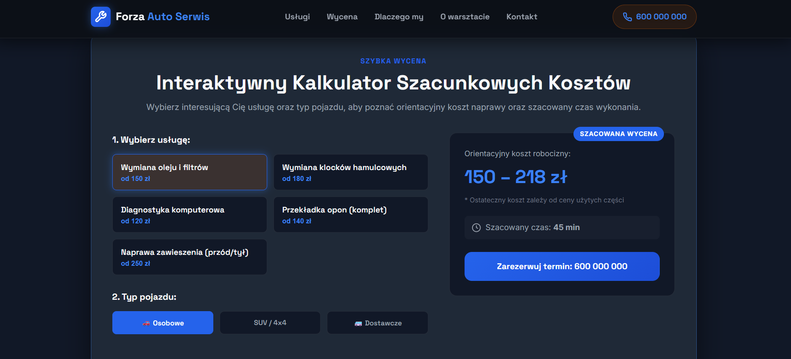

CarService

Statyczna strona wizytówka warsztatu samochodowego, stworzona jako prywatny projekt do nauki HTML, CSS i JavaScriptu. Wszystkie dane (nazwa firmy, telefon, adres, ceny) są przykładowe i wymyślone.

Podgląd

Funkcje
Responsywny układ (komputer, tablet, telefon) z menu mobilnym
Sekcja hero z zapętlonym wideo w tle
Interaktywny kalkulator szacunkowych kosztów: wybór usługi i typu pojazdu przelicza cenę i czas
Nagłówek z cieniem po przewinięciu strony
Stały pasek akcji na telefonie (zadzwoń, nawiguj)
Sekcje: usługi, wycena, dlaczego my, o warsztacie, kontakt z mapą
Technologie

HTML5, CSS3, JavaScript (bez frameworków), Google Fonts (Inter, Space Grotesk)

Uruchomienie

Nie wymaga instalacji. Pobierz repozytorium i otwórz index.html w przeglądarce:

bash
https://github.com/gwisniowski/CarService.git
